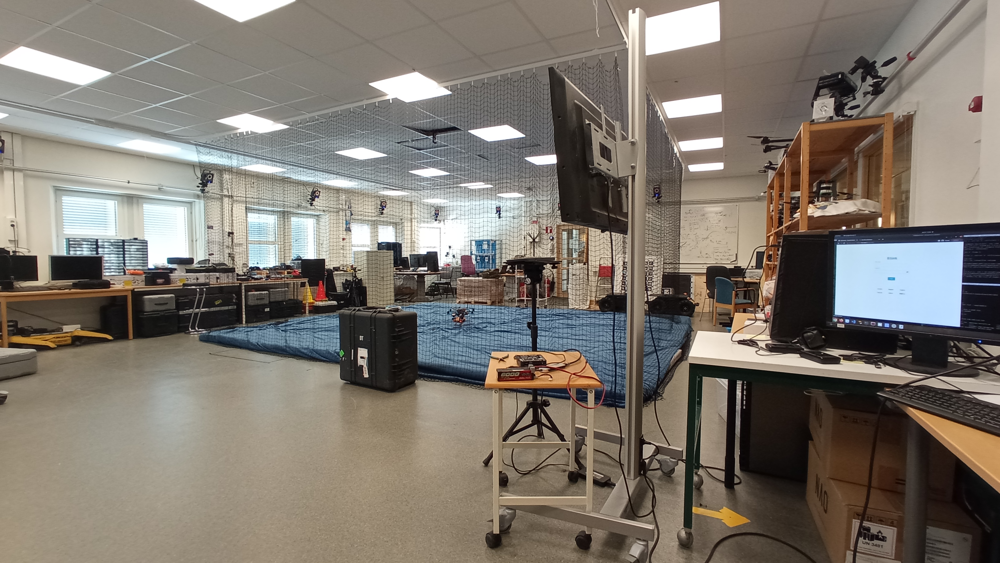
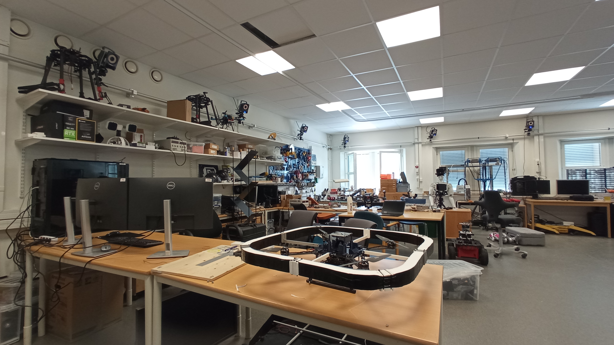
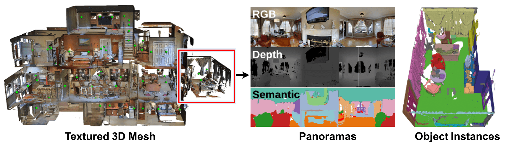

# Matterport Graph-Vector Builder

## Table of Contents
1. [Introduction](#introduction)
    1. [About LTU's Robotics & AI Team](#about-ltus-robotics-and-ai-team)
    2. [About Matterport](#about-matterport)
    3. [About PyTorch Geometric](#about-pytorch-geometric)
        1. [What are Graph Neural Networks?](#what-are-graph-neural-networks)
2. [Research Methodology](#research-methodology)
    1. [Requirements](#requirements)
    2. [Graph-Vector Builder](#graph-vector-builder)

## Introduction

### [About LTU's Robotics and AI Team](https://www.ltu.se/research/subjects/RoboticsAI?l=en)

LTU's Robotics & AI lab is a specialized facility where researchers, engineers, and students work on various aspects of robotics. It is equipped with state-of-the-art hardware and software tools that enable the design, development, and testing of robotic systems. 

The lab serves as a creative and collaborative space for exploring innovative solutions, integrating artificial intelligence, and advancing the field of robotics. It provides an ideal environment for hands-on learning, experimentation, and pushing the boundaries of technological advancements in robotics.

<table>
<tr>
<td></td>
<td></td>
</tr>
</table>

### [About Matterport](https://matterport.com/)

Matterport is a company that specializes in creating advanced spatial data capture technology and software solutions. It is widely known for its 3D reality capture technology, which allows users to create detailed and immersive 3D models of physical spaces, environments, and objects. These models can be explored and interacted with in a virtual environment.

This work uses the available dataset from the paper [Matterport3D: Learning from RGB-D Data in Indoor Environments](https://niessner.github.io/Matterport/), a large-scale RGB-D dataset containing 10,800 panoramic views from 194,400 RGB-D images of 90 building-scale scenes. Annotations are provided with surface reconstructions, camera poses, and 2D and 3D semantic segmentations.

Matterport has selected some of these scenes and published them in their repository [Habitat Matterport3D Research](https://github.com/matterport/habitat-matterport-3dresearch), including statistical files of the scenes and objects.

<table>
<tr>
<td></td>
</tr>
</table>

### [About Pytorch Geometric (PyG)](https://pytorch-geometric.readthedocs.io/)

PyTorch Geometric (PyG) is a library for handling irregularly structured data in deep learning models, particularly in the context of graph-based and geometric deep learning tasks. It provides a wide range of tools and utilities for working with graphs, point clouds, and other irregular data structures using PyTorch as the backend.

PyG offers various graph convolutional layers and neural network modules that enable the implementation of graph convolutional neural networks, a type of model designed for processing graph-structured data.

#### What are Graph Neural Networks?

Graph Neural Networks (GNNs) are a class of neural network architectures designed to operate on graph-structured data. Graphs are mathematical structures that consist of nodes and edges that connect pairs of nodes. GNNs are tailored to handle data represented as graphs, allowing them to capture relationships and dependencies among nodes in complex systems.

## Research Methodology

### Requirements

* The statistical values used for the vector-graph are selected from the **HM3D v0.2** Version of the [**Habitat Matterport Dataset**](https://github.com/matterport/habitat-matterport-3dresearch).
* Python - Version 3.8.10
* Pip Package Installer - Version 20.0.2
* Numpy - Version 1.24.4
* Pandas - Version 2.0.3

### Graph-Vector Builder

This work allows the construction of node and edge vectors in a tree-like hierarchy for GNN input by using the statistical CSV/TSV files avaiable from both the scientific paper and the Habitat Matterport3D Dataset. Two node vectors are provided with respectively 40 and 890 object categories plus the room and building IDs. The edge vector in turn contains tuples of (parent, child) indeces of the nodes denoting the graph connections.

* The size of the node vectors is [num_objects + num_rooms + 1] including the building as the root node.
* The size of the edge vector is [num_objects + num_rooms, 2] without including a recursive edge from/to the building.

The following code shows the available function on [/src/vectorize.py](/src/vectorize.py) and documented results for different scenes can be found under [/docs](/docs/):

```
def vectorize(dataset_name: str, file_output=False):
    # Access CSV stats
    per_scene_neighborhood_stats_path = '/home/fernand0labra/rai-matterport/data/Per_Scene_Neighborhood_Stats.csv'
    per_scene_neighborhood_stats_df = pd.read_csv(per_scene_neighborhood_stats_path, sep = ',', header='infer')

    # Locate dataset row
    per_scene_neighborhood_stats_series = per_scene_neighborhood_stats_df.loc[per_scene_neighborhood_stats_df['Scene Name'].str.match('\d{5}-' + dataset_name)==True]

    # Obtain sizes and build instance array
    num_regions = int(per_scene_neighborhood_stats_series['# Regions'].values[0])
    num_objects = int(per_scene_neighborhood_stats_series['# Objects'].values[0])

    identifier_array_nyu40id = np.empty((num_objects + num_regions + 1), dtype=np.int32) # Scene included
    identifier_array_nyuid = np.empty((num_objects + num_regions + 1), dtype=np.int32) # Scene included
    instance_array = np.empty((num_objects + num_regions, 2), dtype=np.uint32)

    ###

    # Access TSV mappings
    category_mapping_path = '/home/fernand0labra/rai-matterport/data/category_mapping.tsv'
    category_mapping_df = pd.read_csv(category_mapping_path, sep = '\t', header='infer')

    # Access CSV region neighborhoods
    per_scene_region_neighborhoods_path = '/home/fernand0labra/rai-matterport/data/Per_Scene_Region_Neighborhoods.csv'
    per_scene_region_neighborhoods_df = pd.read_csv(per_scene_region_neighborhoods_path, sep = ',', header='infer')

    # Locate dataset rows
    per_scene_region_neighborhoods_series = per_scene_region_neighborhoods_df.loc[per_scene_region_neighborhoods_df['Scene Name'].str.match('\d{5}-' + dataset_name)==True]

    # Setup object nodes and edges
    for idx, region_row in per_scene_region_neighborhoods_series.iterrows():  # For every region of the scene
        for object_instance in region_row['Object Instances in Region'].split(':'):  # For every instance of the region
            instance_split = object_instance.split('_')
            category = instance_split[0]
            instance_id = int(instance_split[1])

            # [0, num_objects - 1]
            instance_array[instance_id-1][0] = region_row['Region #'] - 1 + num_objects

            category_id_nyu40id = category_mapping_df.loc[category_mapping_df['raw_category'] == category]['nyu40id'].values

            # Save the nyu40id and instance indexes
            if category_id_nyu40id.__len__() > 0 and not math.isnan(category_id_nyu40id[0]):
                category_id_value = int(category_id_nyu40id[0])
                
                if category_id_value == 0: continue  # Category 0 is non existant

                identifier_array_nyu40id[instance_id - 1] = category_id_value
                instance_array[instance_id - 1][1] = instance_id - 1
            else:
                identifier_array_nyu40id[instance_id - 1] = 40
                instance_array[instance_id - 1][1] = instance_id - 1

            category_id_nyuid = category_mapping_df.loc[category_mapping_df['raw_category'] == category]['nyuId'].values

            # Save the nyuid 
            if category_id_nyuid.__len__() > 0 and not math.isnan(category_id_nyuid[0]):
                category_id_value = int(category_id_nyuid[0])
                
                if category_id_value == 0: continue  # Category 0 is non existant

                identifier_array_nyuid[instance_id - 1] = category_id_value
            else:
                identifier_array_nyuid[instance_id - 1] = 20

    # Setup room nodes and edges
    for i in range(num_objects, num_objects + num_regions):
        identifier_array_nyu40id[i] = 41  # Room 
        identifier_array_nyuid[i] = 891  # Room 

        instance_array[i][0] = num_objects + num_regions  # Building
        instance_array[i][1] = i

    # Setup building node
    identifier_array_nyu40id[num_objects + num_regions] = 42
    identifier_array_nyuid[num_objects + num_regions] = 892

    if(file_output):
        f = open("/home/fernand0labra/rai-matterport/docs/" + dataset_name + ".txt", "a")
        f.write(str(identifier_array_nyu40id.tolist()) + "\n")
        f.write(str(identifier_array_nyuid.tolist()) + "\n")
        f.write(str(instance_array.tolist()) + "\n")
        f.close()

    return identifier_array_nyu40id, identifier_array_nyuid, instance_array
```